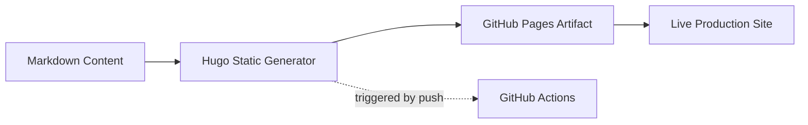

# 🌍 Personal Hugo Site  
_A fast, minimalist blog powered by Hugo and deployed automatically via GitHub Pages._

[](https://journeyman33.github.io/hugo-site/)
[](https://gohugo.io/)
[](https://github.com/journeyman33/hugo-site/actions)

---

This repository contains the source for my personal website and blog.  
It serves as a platform for documenting my projects, sharing lessons learned, and reflecting on my journey in DevOps, cloud engineering, and automation.

The site is built with **Hugo**, a high-performance static site generator, and is deployed continuously through **GitHub Pages** with a fully automated CI/CD workflow.

---

## ⚙️ How It’s Built


## ⚙️ Build & Deployment Overview

- **Hugo** compiles Markdown content into a lightweight static website.  
- **GitHub Actions** builds and deploys the site automatically on every commit.  
- The final build is hosted on **GitHub Pages**, served globally via CDN.  

> _No servers to maintain, no containers to orchestrate — just clean, fast deployment._

---

## 🧰 Tech Stack

| Component       | Technology Used   | Purpose                          |
|-----------------|------------------|----------------------------------|
| Static Site     | **Hugo**         | Site generator / templating      |
| Hosting         | **GitHub Pages** | Global static distribution       |
| CI/CD           | **GitHub Actions** | Automated build + deployment     |
| Content Format  | **Markdown**     | Write once, publish everywhere   |

---

## 📝 Content Focus

This site highlights topics I work with and learn from, including:

- **Kubernetes & cloud-native tooling**  
- **Infrastructure automation and IaC**  
- **Career growth and professional reflection**  
- **Practical DevOps projects & tutorials**

---

## 📰 Featured Posts

| Post | Description |
|------|-------------|
| **Kubernetes Resume Challenge** | Real-world cluster automation challenge + storytelling |
| **KodeKloud Engineer Journey**  | Lessons from hands-on DevOps labs and troubleshooting sessions |

> Each post isn’t just *what I did*, but **why** — and how others can replicate it.

---

## 🚀 Local Development

To run this site locally:

```bash
# Install Hugo (if you don't have it)
brew install hugo

# Clone the site
git clone https://github.com/journeyman33/hugo-site
cd hugo-site

# Run the local dev server
hugo server -D
Then open: **[http://localhost:1313](http://localhost:1313)**
```
---

## 🧭 Future Plans

- Add search support *(Lunr.js or Hugo-compatible search index)*  
- Introduce lightweight tag-based content navigation  
- Publish weekly DevOps deep-dive notes  

---

> **""AI didn’t take my job — it just added me to its CI/CD pipeline.**" 🤖🚀


